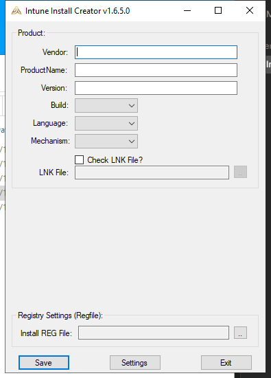

# Intune Install Creator

**Turn any MSI or EXE installer into a ready-to-deploy Microsoft Intune Win32 app package — in under a minute, without touching a command line.**

If you've ever hand-written an `Install.cmd`, fumbled MSI parameters, or repeated the same folder-structure ritual for the tenth app this month, this tool does that part for you. Fill in a few fields, click **Save**, and you get consistent, logged, registry-tracked install/uninstall scripts and a `.intunewin` package ready to upload — every time, the same reliable way.



## Why people use it

- **No more copy-pasted scripts.** Every package gets the same battle-tested Install.cmd/Uninstall.cmd structure — logging, exit-code handling, and registry success/failure tracking included — instead of whatever was hand-edited last time.
- **MSI details, auto-filled.** Point it at an MSI and it reads the Manufacturer, Product Name, Version, and Product Code straight out of the file. No more retyping a GUID.
- **One click to `.intunewin`.** Packaging is built in — no separate step, no forgetting which folder to zip.
- **Stays current on its own.** Automatic, integrity-checked self-updates. You never have to go hunting for "am I on the latest version?"
- **Consistent naming, every time.** Vendor/product/version/file naming conventions are configured once and applied the same way across your whole team.

## Get it

Download the latest build directly:

**[⬇ Download IntuneInstallCreator.exe](https://github.com/Starf0x/Install-Creator-Releases/raw/main/IntuneInstallCreator.exe)**

Requires Windows and .NET Framework 4.8 (already installed on virtually every modern Windows machine). No install needed — it's a single executable.

Want to verify the download before running it? Check its hash against the one published in [`version.ini`](version.ini):

```powershell
Get-FileHash "IntuneInstallCreator.exe" -Algorithm SHA256
```

## New here? Read the guide

**[📖 User Guide](USER_GUIDE.md)** — a full walkthrough: first-run setup, building your first MSI and EXE packages, the shortcut-removal option, and what all the fields actually do.

## About this repository

This repo is the **public update channel** for the tool — it's what the app checks on startup, and what you just downloaded from. The source code itself lives in a separate, private repository, since this is primarily an internal BullWall tool; this repo only ever contains the published `IntuneInstallCreator.exe` and the small `version.ini` manifest the app uses to check for and verify updates. Nothing else is published here.

## License

Internal tool — © BullWall A/S.
